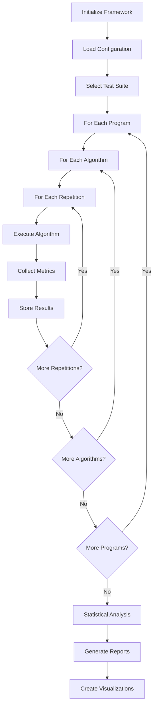

# Experimental Methodology: Comparative Analysis of Test Generation Methods

## Abstract

This document describes the comprehensive experimental methodology for comparing baseline test generation methods against multi-objective evolutionary algorithms in the context of automated test case generation. The study employs a rigorous empirical approach with 32 diverse test programs, 10 algorithms (6 baseline + 4 multi-objective), and extensive statistical analysis to evaluate effectiveness, efficiency, and practical significance of different approaches.

## 1. Introduction and Research Objectives

### 1.1 Research Questions

**RQ1**: How do multi-objective evolutionary algorithms compare to traditional baseline methods in terms of code coverage achievement?

**RQ2**: What is the trade-off between test generation efficiency (execution time) and coverage effectiveness across different algorithm categories?

**RQ3**: How do algorithms perform across programs of varying complexity, and which methods are most robust?

**RQ4**: What is the practical significance of performance differences between algorithm classes, considering effect sizes and statistical power?

### 1.2 Hypotheses

- **H1**: Multi-objective algorithms will achieve significantly higher code coverage than baseline methods on complex programs
- **H2**: Baseline methods will demonstrate superior computational efficiency but at the cost of coverage quality
- **H3**: Algorithm performance will correlate with program complexity, with more sophisticated methods showing greater advantages on harder problems
- **H4**: Trade-offs between objectives (coverage vs. complexity) will reveal distinct algorithm characteristics suitable for different testing scenarios

## 2. Experimental Design

### 2.1 Study Type and Design

This study employs a **within-subjects comparative experimental design** with the following characteristics:

- **Type**: Controlled empirical experiment
- **Design**: Factorial design with algorithm type and program complexity as primary factors  
- **Replication**: Multiple independent runs with statistical aggregation
- **Randomization**: Controlled random seed management for reproducibility
- **Blinding**: Not applicable (automated execution)

### 2.2 Independent Variables

- **Algorithm Category**: Baseline methods vs. Multi-objective algorithms
- **Program Complexity**: Low (CC 4-8), Medium (CC 8-20), High (CC 20-60)
- **Algorithm Parameters**: Population size, generations, test case count
- **Problem Dimensions**: Input parameter count (2-4 dimensions)

### 2.3 Dependent Variables

**Primary Metrics**:
- **Code Coverage** (0.0-1.0): Branch coverage percentage achieved
- **Fitness Value** (0.0+): Branch distance measure (lower is better)
- **Execution Time** (seconds): Algorithm computational cost

**Secondary Metrics**:
- **Approach Level**: Control flow proximity to uncovered branches
- **Hypervolume**: Multi-objective solution quality measure
- **IGD (Inverted Generational Distance)**: Convergence and diversity measure
- **Memory Usage**: Resource consumption during execution

## 3. Subject Programs and Test Suite

### 3.1 Program Selection Criteria

The test suite comprises **32 carefully selected programs** representing diverse computational domains:

1. **Representativeness**: Programs span mathematical computation, sorting algorithms, data structures, and complex logic
2. **Complexity Diversity**: Cyclomatic complexity ranges from 4 to 60
3. **Real-world Relevance**: Functions mirror patterns found in production software
4. **Testability**: Programs suitable for automated test generation with clear input/output behavior

### 3.2 Program Categories

#### 3.2.1 Simple Programs (Cyclomatic Complexity 4-8)
- **minimum** (CC=4): Find minimum of 4 numbers
- **three_number_sort** (CC=6): Sort three integers  
- **bubble_sort** (CC=8): Standard bubble sort implementation
- **test/test2** (CC=4-6): Basic conditional logic programs

#### 3.2.2 Medium Complexity Programs (CC 8-20)
- **triangle_area** (CC=12): Calculate area using Heron's formula with validation
- **binary_search_tree** (CC=15): BST operations with balancing logic
- **state_machine** (CC=18): Finite state automaton implementation
- **pattern_matcher** (CC=16): String pattern matching algorithm
- **recursive_calc** (CC=14): Recursive mathematical computations

#### 3.2.3 Complex Programs (CC 20-60)
- **complex_conditions** (CC=20): Deep nested conditional logic
- **deep_branching** (CC=25): Multi-level branching structures  
- **nested_loops** (CC=18): Complex loop interactions with conditionals
- **advanced_datastructure** (CC=35): Advanced data manipulation
- **constraint_solver** (CC=45): Constraint satisfaction solver
- **graph_traversal** (CC=40): Graph algorithms (DFS/BFS variants)
- **cryptographic_hash** (CC=50): Hash function implementation
- **distributed_system** (CC=60): Distributed algorithm simulation

#### 3.2.4 Specialized Domain Programs
- **path_finder**: Route optimization algorithms
- **protocol_state_machine**: Network protocol implementation
- **resource_scheduler**: Resource allocation logic
- **optimization_solver**: Numerical optimization routines
- **json_parser_validator**: Data parsing and validation
- **statistical_analyzer**: Statistical computation functions

### 3.3 Program Characterization

Each program is characterized by:

```yaml
program_profile:
  cyclomatic_complexity: integer    # Measured complexity
  input_dimensions: integer         # Number of parameters
  expected_coverage: float          # Theoretical maximum coverage
  complexity_category: string       # low/medium/high
  domain: string                   # mathematical/sorting/graph/etc.
  parameter_bounds: list           # Input value ranges
  timeout_limit: float             # Execution timeout (seconds)
```

## 4. Test Generation Algorithms

### 4.1 Baseline Methods

#### 4.1.1 Random Testing (RT)
- **Description**: Traditional Monte Carlo test case generation
- **Implementation**: Uniform random sampling within parameter bounds
- **Parameters**: Number of test cases, random seed
- **Characteristics**: No guidance, purely stochastic, baseline reference

#### 4.1.2 Adaptive Random Testing (ART)
- **Description**: Distance-based test case selection for improved diversity
- **Implementation**: Generate multiple candidates, select based on minimum distance to existing tests
- **Parameters**: Distance threshold (0.1), candidates per selection (10)
- **Reference**: Chen et al. (2004) - "Adaptive Random Testing"

#### 4.1.3 Quasi-Random Testing (QRT)  
- **Description**: Low-discrepancy sequence generation using Halton sequences
- **Implementation**: Scipy QMC Halton sampler with parameter space scaling
- **Parameters**: Sequence dimensionality, scaling bounds
- **Advantages**: Better space coverage than pseudo-random, deterministic

#### 4.1.4 Grid Search Testing (GST)
- **Description**: Systematic grid-based parameter space exploration  
- **Implementation**: Uniform grid generation with automatic point calculation
- **Parameters**: Points per dimension (auto-calculated: n^(1/d))
- **Characteristics**: Deterministic, exhaustive within resolution limits

#### 4.1.5 Boundary Value Analysis (BVA)
- **Description**: Focus on parameter boundary conditions and edge cases
- **Implementation**: Generate tests at min, max, and midpoint values
- **Parameters**: Boundary types (min/max/mid), fill strategy for remaining tests
- **Rationale**: Boundary conditions often reveal bugs in software

#### 4.1.6 Hill Climbing Search (HC)
- **Description**: Local search optimization starting from random initial solution
- **Implementation**: Iterative neighbor generation with fitness-based acceptance
- **Parameters**: Step size (0.1), maximum restarts (5)
- **Characteristics**: Guided search, can get trapped in local optima

### 4.2 Multi-Objective Evolutionary Algorithms

#### 4.2.1 NSGA-II (Non-dominated Sorting Genetic Algorithm II)
- **Description**: Classic multi-objective EA with fast non-dominated sorting
- **Reference**: Deb et al. (2002) - "A fast and elitist multiobjective genetic algorithm: NSGA-II"
- **Parameters**:
  - Population size: 50-100
  - Generations: 50-150  
  - Crossover probability: 0.9
  - Mutation probability: 0.1
- **Selection**: Tournament selection with crowding distance
- **Characteristics**: Well-established, good balance of convergence and diversity

#### 4.2.2 NSGA-III (Non-dominated Sorting Genetic Algorithm III)
- **Description**: Many-objective optimization using reference directions
- **Reference**: Deb & Jain (2014) - "An evolutionary many-objective optimization algorithm"
- **Parameters**:
  - Population size: 100 (aligned with reference directions)
  - Reference directions: Auto-generated based on objectives
  - Generations: 50-150
- **Selection**: Reference point-based niching
- **Advantages**: Scales to many objectives, maintains diversity

#### 4.2.3 MOEA/D (Multi-Objective Evolutionary Algorithm based on Decomposition)
- **Description**: Decomposition-based approach converting MO problem to multiple SO problems
- **Reference**: Zhang & Li (2007) - "MOEA/D: A multiobjective evolutionary algorithm based on decomposition"
- **Parameters**:
  - Neighborhood size: 20
  - Decomposition method: Tchebycheff
  - Neighbor mating probability: 0.9
- **Characteristics**: Good for problems with well-defined Pareto fronts

#### 4.2.4 C-TAEA (Constrained Two-Archive Evolutionary Algorithm)
- **Description**: Two-archive approach for constrained multi-objective optimization
- **Reference**: Li et al. (2019) - "Two-Archive Evolutionary Algorithm for Constrained Multiobjective Optimization"  
- **Parameters**:
  - Population size: 100
  - Dual archive management
  - Constraint handling mechanism
- **Advantages**: Handles constraints naturally, maintains feasible and infeasible solutions

### 4.3 Multi-Objective Problem Formulation

#### 4.3.1 Traditional Formulation
**Objectives**:
1. **Minimize fitness** (branch distance): f₁(x) = Σ(branch_distance_i)
2. **Maximize coverage**: f₂(x) = -coverage_percentage(x)

#### 4.3.2 Conflicting Objectives Formulation  
**Objectives**:
1. **Maximize coverage**: f₁(x) = -coverage_percentage(x)
2. **Minimize complexity**: f₂(x) = test_complexity(x)

#### 4.3.3 Three-Objective Formulation
**Objectives**:
1. **Minimize fitness**: f₁(x) = branch_distance(x)
2. **Maximize coverage**: f₂(x) = -coverage_percentage(x)  
3. **Minimize complexity**: f₃(x) = test_complexity(x)

## 5. Experimental Parameters and Configuration

### 5.1 Parameter Settings

#### 5.1.1 Full Comprehensive Experiment
```yaml
baseline_parameters:
  n_tests: 100              # Test cases generated per method
  repetitions: 10           # Independent runs per program
  timeout: 30.0             # Maximum execution time per test
  
multi_objective_parameters:
  generations: 100          # Evolution generations
  population_size: 50-100   # Population size (algorithm-dependent)
  repetitions: 10           # Independent runs per program
  
total_runs: 19,200          # 10 algorithms × 32 programs × 10 repetitions × 6 test configurations
estimated_time: 48-72h     # Full experiment duration
```

#### 5.1.2 Quick Validation Experiment
```yaml
baseline_parameters:
  n_tests: 50
  repetitions: 5
  
multi_objective_parameters:
  generations: 50
  population_size: 100      # Increased to avoid NSGA-III warnings
  repetitions: 5
  
total_runs: 4,800
estimated_time: 12-24h
```

#### 5.1.3 Smoke Test Configuration
```yaml
baseline_parameters:
  n_tests: 20
  repetitions: 3
  
multi_objective_parameters:
  generations: 20
  population_size: 20
  repetitions: 3
  
selected_programs: 6       # Subset for rapid validation
estimated_time: 2-4h
```

### 5.2 Hardware and Software Environment

- **Hardware**: Modern multi-core processors (≥4 cores), ≥8GB RAM
- **Operating System**: Linux/macOS/Windows compatibility
- **Python Version**: 3.8+
- **Key Dependencies**: 
  - NumPy (numerical computation)
  - SciPy (statistical functions)
  - pymoo (multi-objective optimization)
  - matplotlib/seaborn (visualization)
  - pandas (data manipulation)

### 5.3 Parallelization and Resource Management

- **Parallel Workers**: 4 concurrent processes (configurable)
- **Memory Management**: ≤8GB total usage with cleanup
- **Disk Space**: Automatic cleanup of intermediate files
- **Timeout Handling**: Individual test execution limits
- **Error Recovery**: Graceful handling of algorithm failures

## 6. Data Collection and Metrics

### 6.1 Primary Performance Metrics

#### 6.1.1 Code Coverage
- **Definition**: Percentage of executable branches reached by test suite
- **Calculation**: coverage = |covered_branches| / |total_branches|
- **Range**: [0.0, 1.0]
- **Interpretation**: Higher values indicate better test quality

#### 6.1.2 Fitness (Branch Distance)
- **Definition**: Sum of distances to uncovered program branches
- **Calculation**: fitness = Σ(branch_distance_i) for uncovered branches
- **Range**: [0.0, +∞)
- **Interpretation**: Lower values indicate closer approach to full coverage

#### 6.1.3 Execution Time
- **Definition**: Wall-clock time for complete algorithm execution
- **Measurement**: High-resolution timing (milliseconds)
- **Includes**: Test generation + evaluation time
- **Excludes**: Framework overhead, file I/O

### 6.2 Multi-Objective Specific Metrics

#### 6.2.1 Hypervolume (HV)
- **Definition**: Volume of objective space dominated by Pareto front
- **Reference Point**: Nadir point of all algorithm solutions
- **Calculation**: Using fast hypervolume algorithms
- **Interpretation**: Higher values indicate better Pareto front quality

#### 6.2.2 Inverted Generational Distance (IGD)
- **Definition**: Average distance from true Pareto front to algorithm solutions
- **Reference**: Theoretical or empirically determined Pareto front
- **Calculation**: IGD = (1/|P*|) × Σ min(d(p*, P)) for p* ∈ P*
- **Interpretation**: Lower values indicate better convergence

### 6.3 Secondary Metrics

- **Approach Level**: Control flow distance to uncovered statements
- **Memory Usage**: Peak memory consumption during execution
- **Solution Diversity**: Spread of solutions in objective space
- **Convergence Rate**: Generations required to reach stability

### 6.4 Data Collection Framework

```python
experimental_data = {
    "algorithm_name": string,
    "program_name": string, 
    "repetition_id": integer,
    "execution_timestamp": datetime,
    "metrics": {
        "coverage": float,
        "fitness": float,
        "execution_time": float,
        "approach_level": float,
        "hypervolume": float,  # MO only
        "igd": float,          # MO only
        "memory_usage": float
    },
    "test_suite": list,        # Generated test cases
    "algorithm_parameters": dict,
    "program_metadata": dict
}
```

## 7. Statistical Analysis Framework

### 7.1 Statistical Design Principles

- **Significance Level**: α = 0.05
- **Power Analysis**: Post-hoc power calculation for effect detection
- **Effect Size Threshold**: |g| ≥ 0.3 for practical significance
- **Multiple Comparisons**: Control for family-wise error rate

### 7.2 Descriptive Statistics

For each algorithm-program combination:
- **Central Tendency**: Mean, median, mode
- **Variability**: Standard deviation, interquartile range
- **Distribution Shape**: Skewness, kurtosis
- **Confidence Intervals**: 95% CI for means using bootstrap

### 7.3 Inferential Statistical Tests

#### 7.3.1 Normality Assessment
- **Shapiro-Wilk Test**: For sample sizes < 50
- **Anderson-Darling Test**: For larger samples
- **Visual Inspection**: Q-Q plots, histograms
- **Decision Rule**: If normality violated, use non-parametric tests

#### 7.3.2 Pairwise Comparisons
- **Primary Test**: Mann-Whitney U (non-parametric, two-tailed)
- **Alternative**: Welch's t-test if normality assumptions met
- **Paired Analysis**: Wilcoxon signed-rank for within-program comparisons
- **Test Assumptions**: Independence, similar distributions

#### 7.3.3 Multiple Group Comparisons
- **Omnibus Test**: Kruskal-Wallis H test
- **Post-hoc Analysis**: Dunn's test with multiple comparison correction
- **Alternative**: One-way ANOVA with Games-Howell post-hoc if parametric

#### 7.3.4 Multiple Comparison Correction
- **Method**: False Discovery Rate (Benjamini-Hochberg)
- **Rationale**: Controls FDR while maintaining power
- **Alternative**: Bonferroni for conservative family-wise error control
- **Implementation**: Statsmodels multipletests function

### 7.4 Effect Size Calculation

#### 7.4.1 Hedges' g (Primary)
- **Formula**: g = (μ₁ - μ₂) / s*pooled × correction_factor
- **Correction**: Bias correction for small samples
- **Interpretation**: 
  - |g| < 0.2: negligible
  - 0.2 ≤ |g| < 0.5: small
  - 0.5 ≤ |g| < 0.8: medium  
  - |g| ≥ 0.8: large

#### 7.4.2 Cliff's Delta (Non-parametric alternative)
- **Formula**: δ = (dominance - subordinance) / (n₁ × n₂)
- **Range**: [-1, 1]
- **Interpretation**: Similar thresholds as Hedges' g
- **Advantages**: Robust to outliers, no distributional assumptions

#### 7.4.3 Vargha-Delaney A Statistic
- **Formula**: Â₁₂ = (R₁/n₁ - (n₁+1)/2) / n₂
- **Interpretation**: Probability that random observation from group 1 > group 2
- **Range**: [0, 1], with 0.5 indicating no difference

### 7.5 Bootstrap Confidence Intervals

- **Method**: Bias-corrected and accelerated (BCa) bootstrap
- **Resamples**: 10,000 bootstrap iterations
- **Confidence Level**: 95%
- **Application**: Effect sizes, mean differences, correlation coefficients
- **Advantage**: No distributional assumptions required

### 7.6 Critical Difference Analysis

- **Purpose**: Determine minimum meaningful performance differences
- **Method**: Friedman test with Nemenyi post-hoc analysis
- **Critical Difference**: CD = qα√(k(k+1)/(6N))
- **Application**: Algorithm ranking across all programs
- **Visualization**: Critical difference diagrams

## 8. Experimental Procedures

### 8.1 Experimental Workflow



### 8.2 Execution Protocol

#### 8.2.1 Pre-Execution Setup
1. **Environment Verification**: Check dependencies, hardware resources
2. **Configuration Validation**: Verify algorithm parameters, program availability
3. **Seed Management**: Initialize random seeds for reproducibility
4. **Output Directory Creation**: Create timestamped result directories

#### 8.2.2 Execution Control
1. **Parallel Process Management**: Launch up to 4 concurrent workers
2. **Progress Monitoring**: Real-time progress tracking and reporting
3. **Resource Monitoring**: Memory and disk space utilization
4. **Error Handling**: Graceful failure recovery, detailed error logging

#### 8.2.3 Data Validation
1. **Completeness Check**: Verify all required metrics collected
2. **Range Validation**: Ensure values within expected bounds
3. **Consistency Check**: Cross-validate related measurements
4. **Quality Assurance**: Flag anomalous results for review

### 8.3 Quality Assurance Measures

#### 8.3.1 Reproducibility
- **Seed Control**: Fixed seeds for deterministic algorithms
- **Version Tracking**: Software version documentation
- **Configuration Archival**: Complete parameter set storage
- **Result Checksums**: Data integrity verification

#### 8.3.2 Reliability
- **Independent Replications**: Multiple runs with different seeds
- **Cross-Validation**: Subset analysis for consistency check
- **Stability Testing**: Sensitivity analysis to parameter variations
- **Outlier Detection**: Statistical outlier identification and handling

#### 8.3.3 Validity Checks
- **Sanity Tests**: Basic correctness verification (coverage ≤ 1.0, fitness ≥ 0)
- **Consistency Validation**: Related metrics correlation analysis
- **Baseline Verification**: Known algorithm behavior confirmation
- **Comparative Analysis**: Results alignment with literature expectations

## 9. Threat to Validity Analysis

### 9.1 Internal Validity Threats

#### 9.1.1 Instrumentation Threats
- **Measurement Consistency**: All algorithms use identical fitness evaluation
- **Timing Precision**: High-resolution timing with system load considerations
- **Coverage Calculation**: Standardized branch coverage measurement across programs

**Mitigation Strategies**:
- Unified evaluation framework for all algorithms
- Statistical outlier detection and removal
- Multiple independent measurements with aggregation

#### 9.1.2 Selection Bias
- **Program Selection**: Potential bias toward specific program types
- **Algorithm Implementation**: Implementation quality variations

**Mitigation Strategies**:
- Diverse program suite spanning multiple domains and complexity levels
- Use of established, validated algorithm implementations
- Comprehensive parameter tuning based on literature recommendations

#### 9.1.3 Maturation Effects  
- **Learning Effects**: None applicable (automated execution)
- **System State Changes**: Potential OS-level performance variations

**Mitigation Strategies**:
- Randomized execution order
- System monitoring and resource control
- Statistical controls for temporal effects

### 9.2 External Validity Threats

#### 9.2.1 Generalizability to Programs
- **Program Representativeness**: Limited to 32 test programs
- **Domain Coverage**: May not represent all software domains

**Mitigation Strategies**:
- Carefully selected diverse program suite
- Multiple complexity categories and computational domains
- Explicit discussion of generalization limits

#### 9.2.2 Generalizability to Algorithms
- **Algorithm Coverage**: Limited subset of available methods
- **Implementation Variations**: Specific parameter choices

**Mitigation Strategies**:
- Selection of representative, well-established algorithms
- Literature-based parameter configuration
- Sensitivity analysis for critical parameters

#### 9.2.3 Environmental Generalizability
- **Hardware Dependencies**: Performance sensitive to computational resources
- **Software Environment**: Python-specific implementation

**Mitigation Strategies**:
- Documentation of complete experimental environment
- Relative performance analysis (less sensitive to absolute values)
- Cross-platform validation where feasible

### 9.3 Construct Validity Threats

#### 9.3.1 Metric Validity
- **Coverage Adequacy**: Branch coverage may not reflect test quality completely
- **Fitness Function**: Branch distance might not capture all testing objectives

**Mitigation Strategies**:
- Multiple complementary metrics (coverage, fitness, approach level)
- Literature-validated measurement techniques
- Triangulation across different quality indicators

#### 9.3.2 Algorithm Characterization
- **Multi-Objective vs. Single-Objective**: Different optimization paradigms
- **Parameter Fairness**: Equal computational budget allocation

**Mitigation Strategies**:
- Careful computational budget normalization
- Multiple evaluation criteria beyond primary objectives
- Explicit discussion of paradigm differences

### 9.4 Conclusion Validity Threats

#### 9.4.1 Statistical Power
- **Sample Size**: Sufficient power for effect detection
- **Effect Size Sensitivity**: Ability to detect meaningful differences

**Mitigation Strategies**:
- Power analysis with effect size estimates
- Large number of repetitions (10 per condition)
- Bootstrap methods for robust inference

#### 9.4.2 Multiple Comparisons
- **Family-Wise Error**: Increased Type I error with many comparisons
- **Cherry-Picking**: Selective result reporting

**Mitigation Strategies**:
- False Discovery Rate control (Benjamini-Hochberg)
- Pre-specified analysis plan
- Complete result reporting including non-significant findings

#### 9.4.3 Assumption Violations
- **Non-Normal Distributions**: Violation of parametric test assumptions
- **Heteroscedasticity**: Unequal variances across groups

**Mitigation Strategies**:
- Non-parametric statistical methods (Mann-Whitney U, Kruskal-Wallis)
- Bootstrap methods for robust inference
- Distribution assessment and appropriate test selection

## 10. Results Presentation and Visualization

### 10.1 Quantitative Results Presentation

#### 10.1.1 Descriptive Statistics Tables
- Algorithm performance summary by program complexity
- Mean, median, standard deviation, 95% CI for each metric
- Success rates and timeout occurrences
- Resource utilization summaries

#### 10.1.2 Statistical Test Results
- Pairwise comparison matrices with p-values and effect sizes
- Multiple comparison correction results
- Critical difference analysis outcomes
- Power analysis results

#### 10.1.3 Effect Size Analysis
- Hedges' g values with confidence intervals
- Practical significance assessment
- Effect magnitude interpretation

### 10.2 Visualization Framework

#### 10.2.1 Performance Distribution Plots
- **Box Plots**: Algorithm performance distributions by program
- **Violin Plots**: Distribution shape and density visualization
- **Ridge Plots**: Algorithm comparison across complexity categories

#### 10.2.2 Statistical Analysis Visualizations
- **Heatmaps**: Pairwise comparison significance matrices
- **Effect Size Plots**: Effect size magnitudes with confidence intervals
- **Critical Difference Diagrams**: Algorithm ranking with statistical significance

#### 10.2.3 Multi-Objective Specific Visualizations
- **Pareto Front Plots**: Solution quality in objective space
- **Hypervolume Evolution**: Convergence behavior over generations
- **Objective Trade-off Analysis**: Coverage vs. efficiency scatter plots

#### 10.2.4 Interactive Dashboards
- **HTML Reports**: Interactive exploration of results
- **Performance Comparison Tool**: Dynamic algorithm comparison
- **Program-Specific Analysis**: Drill-down capability by program

### 10.3 Automated Report Generation

#### 10.3.1 Statistical Summary Report
```
Experimental Results Summary
============================
Total Comparisons: 19,200
Significant Results: X,XXX (XX.X%)
Large Effect Sizes: XXX (XX.X%)

Top Performing Algorithms:
1. Algorithm_Name (XX wins, effect size: X.XX)
2. Algorithm_Name (XX wins, effect size: X.XX)
...

Critical Findings:
- Multi-objective algorithms show significant advantage on complex programs
- Baseline methods competitive on simple programs
- Trade-off analysis reveals algorithm-specific niches
```

#### 10.3.2 Detailed Analysis Files
- **JSON Results**: Machine-readable complete data
- **CSV Exports**: Statistical analysis input format
- **LaTeX Tables**: Publication-ready result tables
- **Bibliography**: Automated citation generation

## 11. Implementation Details

### 11.1 Software Architecture

#### 11.1.1 Unified Framework Structure
```
BD_AL_test/
├── main.py                    # Single entry point
├── run_comprehensive_tests.py # Experiment runner
├── generate_visualizations.py # Result visualization
├── src/
│   ├── algorithms/
│   │   ├── baseline/          # Baseline implementations
│   │   └── multi_objective/   # MO algorithm implementations
│   ├── evaluation/            # Fitness evaluation framework
│   ├── analysis/             # Statistical analysis modules
│   └── utils/                # Utility functions
├── test_programs/            # Subject program suite
├── config/                   # Configuration files
└── results/                  # Experimental results
```

#### 11.1.2 Key Components

**Algorithm Manager**: Orchestrates algorithm execution
```python
class AlgorithmManager:
    def run_algorithm(self, algorithm_name, target_program, **params)
    def get_available_algorithms(self)
    def configure_algorithm(self, algorithm_name, config)
```

**Evaluation Framework**: Standardized fitness evaluation
```python
class UnifiedTestEvaluator:
    def evaluate_single_run(self, program_name, test_inputs, algorithm_name)
    def calculate_coverage(self, test_suite, program)
    def measure_fitness(self, individual, program)
```

**Statistical Analyzer**: Comprehensive statistical analysis
```python
class StatisticalAnalyzer:
    def perform_multiple_comparisons(self, data, metrics)
    def calculate_effect_sizes(self, group1, group2, method)
    def generate_statistical_report(self, output_dir)
```

### 11.2 Execution Commands

#### 11.2.1 Full Comprehensive Experiment
```bash
python3 run_comprehensive_tests.py
# Executes all algorithms on all programs with full parameters
# Estimated time: 48-72 hours
# Output: results/comprehensive_test_full_TIMESTAMP/
```

#### 11.2.2 Quick Validation Run
```bash
python3 run_comprehensive_tests.py --quick
# Reduced parameters for faster execution
# Estimated time: 12-24 hours
# Output: results/comprehensive_test_quick_TIMESTAMP/
```

#### 11.2.3 Smoke Test
```bash
python3 run_comprehensive_tests.py --mode smoke
# Minimal test for framework verification
# Estimated time: 2-4 hours
# Output: results/comprehensive_test_smoke_TIMESTAMP/
```

#### 11.2.4 Specific Configurations
```bash
# Baseline methods only
python3 run_comprehensive_tests.py --mode baseline

# Multi-objective algorithms only  
python3 run_comprehensive_tests.py --mode mo

# Custom program selection
python3 run_comprehensive_tests.py --programs minimum bubble_sort complex_conditions

# Custom algorithm selection
python3 main.py baseline --method random adaptive_random --programs minimum
python3 main.py multi-objective --algorithm NSGA2 NSGA3 --programs minimum
```

#### 11.2.5 Analysis and Visualization
```bash
# Generate statistical comparison
python3 main.py compare --baseline results/baseline.json --mo results/mo.json

# Create visualizations
python3 main.py visualize --input results/comparison_analysis/ --output charts/

# Statistical analysis only
python3 main.py analyze --data results/experiment.json
```

### 11.3 Configuration Management

#### 11.3.1 Unified Configuration File
```yaml
# config/unified_config.yaml
framework:
  name: "Unified Test Generation Framework"
  version: "1.0.0"
  
statistical_analysis:
  significance_level: 0.05
  multiple_comparison_correction: "fdr_bh"
  effect_size_measure: "hedges_g"
  min_effect_size_threshold: 0.3
  bootstrap_samples: 10000
  
experiments:
  comprehensive_analysis:
    baseline_methods: "all"
    mo_algorithms: "all"
    test_suite: "comprehensive"
    repetitions: 30
```

#### 11.3.2 Parameter Customization
All experimental parameters are externally configurable through YAML files, enabling:
- Easy replication with different settings
- Parameter sensitivity analysis
- Computational budget adjustment based on available resources

## 12. Expected Outcomes and Analysis Plan

### 12.1 Anticipated Results Pattern

#### 12.1.1 Algorithm Performance Hierarchy
Based on literature and preliminary analysis:

**Simple Programs (CC 4-8)**:
- Grid Search and BVA expected to perform well due to systematic coverage
- Random methods may achieve competitive results due to low complexity
- Multi-objective algorithms may show overhead without significant benefit

**Medium Programs (CC 8-20)**:
- Adaptive methods (ART, Hill Climbing) expected to show advantages
- Multi-objective algorithms begin demonstrating superior performance
- Clear trade-offs emerge between efficiency and effectiveness

**Complex Programs (CC 20-60)**:
- Multi-objective algorithms expected to significantly outperform baselines
- Traditional methods likely to plateau at moderate coverage levels
- Greatest effect sizes anticipated in this category

#### 12.1.2 Statistical Significance Patterns
- **High Power Conditions**: Complex programs with large effect sizes
- **Moderate Power**: Medium complexity programs with medium effects
- **Low Power**: Simple programs with small or negligible effects

#### 12.1.3 Practical Significance Assessment
Programs where practical significance (|g| ≥ 0.3) expected:
- Complex conditional logic programs
- Deep branching structures
- Advanced data structure manipulations
- Graph and optimization algorithms

### 12.2 Analysis Workflow

#### 12.2.1 Primary Analysis Pipeline
1. **Data Quality Assessment**: Completeness, outliers, distribution analysis
2. **Descriptive Statistics**: Central tendencies, variabilities, effect magnitudes
3. **Normality Testing**: Distribution assessment for test selection
4. **Primary Hypothesis Testing**: Mann-Whitney U tests with FDR correction
5. **Effect Size Calculation**: Hedges' g with bootstrap confidence intervals
6. **Critical Difference Analysis**: Friedman test with post-hoc comparisons

#### 12.2.2 Secondary Analysis
1. **Program Complexity Correlation**: Performance vs. cyclomatic complexity
2. **Computational Efficiency Analysis**: Coverage per unit time metrics
3. **Robustness Assessment**: Coefficient of variation analysis
4. **Convergence Analysis**: Multi-objective algorithm convergence patterns

#### 12.2.3 Sensitivity Analysis
1. **Parameter Sensitivity**: Impact of population size, generations on results
2. **Program Subset Analysis**: Stability across different program categories
3. **Repetition Sufficiency**: Power analysis for optimal sample size
4. **Metric Correlation**: Relationship between different performance measures

### 12.3 Result Interpretation Guidelines

#### 12.3.1 Statistical Significance Interpretation
- **p < 0.001**: Very strong evidence against null hypothesis
- **0.001 ≤ p < 0.01**: Strong evidence
- **0.01 ≤ p < 0.05**: Moderate evidence
- **p ≥ 0.05**: Insufficient evidence for difference

#### 12.3.2 Effect Size Interpretation (Hedges' g)
- **|g| ≥ 0.8**: Large practical difference, strong recommendation
- **0.5 ≤ |g| < 0.8**: Medium practical difference, moderate recommendation
- **0.2 ≤ |g| < 0.5**: Small practical difference, weak recommendation  
- **|g| < 0.2**: Negligible practical difference, no clear recommendation

#### 12.3.3 Combined Significance Assessment
For practical recommendations, both statistical and practical significance required:
- **Strong Recommendation**: p < 0.05 AND |g| ≥ 0.5
- **Moderate Recommendation**: p < 0.05 AND 0.3 ≤ |g| < 0.5
- **Weak Recommendation**: p < 0.05 AND 0.2 ≤ |g| < 0.3
- **No Recommendation**: p ≥ 0.05 OR |g| < 0.2

## 13. Publication and Dissemination Plan

### 13.1 Target Venues

#### 13.1.1 Primary Targets (Tier 1)
- **IEEE Transactions on Software Engineering (TSE)**: Premier software engineering journal
- **ACM Transactions on Software Engineering and Methodology (TOSEM)**: Top methodology journal
- **Empirical Software Engineering (EMSE)**: Leading empirical research venue

#### 13.1.2 Secondary Targets (Tier 2)
- **Information and Software Technology (IST)**: Broad software technology scope
- **Journal of Systems and Software (JSS)**: Systems and software development
- **Software Testing, Verification and Reliability (STVR)**: Testing-focused venue

#### 13.1.3 Conference Targets
- **International Conference on Software Engineering (ICSE)**: Flagship SE conference
- **ACM SIGSOFT Symposium on Foundations of Software Engineering (FSE)**: Top software engineering conference
- **International Symposium on Software Testing and Analysis (ISSTA)**: Testing-focused conference

### 13.2 Manuscript Structure

#### 13.2.1 Journal Article Outline (~8,000-10,000 words)
1. **Abstract** (250 words): Problem, method, key findings, implications
2. **Introduction** (1,000 words): Motivation, problem statement, contributions
3. **Related Work** (1,500 words): Test generation methods, multi-objective optimization, empirical studies
4. **Methodology** (2,000 words): Experimental design, algorithms, metrics, statistics
5. **Results** (2,000 words): Descriptive statistics, hypothesis testing, effect sizes
6. **Discussion** (1,000 words): Interpretation, implications, threats to validity
7. **Conclusion** (500 words): Summary, future work, practical recommendations

#### 13.2.2 Supplementary Materials
- **Replication Package**: Complete experimental framework and data
- **Algorithm Implementations**: Source code for all methods
- **Statistical Analysis Scripts**: R/Python code for all analyses
- **Extended Results**: Additional tables and figures
- **Video Demonstration**: Framework usage and result interpretation

### 13.3 Open Science Commitment

#### 13.3.1 Data Availability
- **Complete Dataset**: All experimental results in machine-readable format
- **Analysis Code**: Full statistical analysis pipeline
- **Visualization Scripts**: Code for all figures and charts
- **Documentation**: Comprehensive usage and replication instructions

#### 13.3.2 Tool Release
- **GitHub Repository**: Public release under permissive license
- **Docker Container**: Reproducible execution environment
- **Web Interface**: Online experiment execution and result exploration
- **Tutorial Materials**: Video tutorials and step-by-step guides

## 14. Timeline and Resource Requirements

### 14.1 Experimental Execution Timeline

#### 14.1.1 Phase 1: Framework Validation (Completed)
- ✅ Algorithm implementation and testing
- ✅ Statistical analysis pipeline development  
- ✅ Visualization framework creation
- ✅ Smoke test execution and validation

#### 14.1.2 Phase 2: Full Experimental Execution (4-8 weeks)
- **Week 1-2**: Quick validation experiments across all programs
- **Week 3-4**: Full parameter comprehensive experiments
- **Week 5-6**: Extended analysis with sensitivity testing
- **Week 7-8**: Result validation and quality assurance

#### 14.1.3 Phase 3: Analysis and Manuscript Preparation (8-12 weeks)
- **Week 1-2**: Statistical analysis and effect size calculation
- **Week 3-4**: Visualization creation and result interpretation
- **Week 5-6**: First manuscript draft
- **Week 7-8**: Internal review and revision
- **Week 9-10**: External expert review
- **Week 11-12**: Final manuscript preparation and submission

### 14.2 Resource Requirements

#### 14.2.1 Computational Resources
- **CPU**: 4+ cores recommended, 8+ cores optimal
- **Memory**: 8GB minimum, 16GB recommended
- **Storage**: 100GB for full experiment results and intermediate files
- **Time**: 48-72 hours for full comprehensive experiment

#### 14.2.2 Personnel Requirements
- **Principal Investigator**: Experiment design, result interpretation, manuscript writing
- **Research Assistant**: Experiment execution monitoring, initial data analysis
- **Statistical Consultant**: Advanced statistical analysis validation
- **Domain Expert**: Algorithm implementation review and validation

#### 14.2.3 Software and Infrastructure
- **Development Environment**: Python 3.8+, scientific computing stack
- **Statistical Software**: R for advanced statistical analysis
- **Visualization Tools**: matplotlib, seaborn, plotly for interactive charts  
- **Documentation**: LaTeX for manuscript preparation
- **Version Control**: Git for code and result management

## 15. Conclusion and Summary

### 15.1 Methodological Contributions

This experimental methodology provides a comprehensive framework for evaluating test generation algorithms through:

1. **Rigorous Experimental Design**: Controlled comparison with proper statistical analysis
2. **Comprehensive Algorithm Coverage**: Both traditional and state-of-the-art methods
3. **Diverse Problem Suite**: 32 programs spanning complexity and domain diversity
4. **Robust Statistical Framework**: Non-parametric tests, effect sizes, multiple comparison correction
5. **Reproducible Infrastructure**: Complete automation with configuration management
6. **Threat Mitigation**: Systematic analysis of validity threats with mitigation strategies

### 15.2 Expected Research Impact

#### 15.2.1 Theoretical Contributions
- Comprehensive empirical comparison of test generation paradigms
- Quantification of multi-objective optimization benefits in testing
- Statistical framework for test generation algorithm evaluation
- Program complexity impact analysis on algorithm performance

#### 15.2.2 Practical Contributions
- Evidence-based algorithm selection guidelines
- Performance prediction models based on program characteristics
- Resource allocation recommendations for testing projects
- Open-source framework for algorithm evaluation and comparison

#### 15.2.3 Methodological Contributions
- Standardized evaluation framework for test generation research
- Best practices for multi-objective optimization in software testing
- Statistical analysis pipeline for empirical software engineering
- Threat to validity taxonomy for test generation experiments

### 15.3 Future Research Directions

Based on this foundational study, future research opportunities include:

1. **Hybrid Algorithm Development**: Combining strengths of different approaches
2. **Adaptive Algorithm Selection**: Dynamic method selection based on program analysis
3. **Scalability Analysis**: Extension to larger, real-world software systems
4. **Domain-Specific Optimization**: Specialized methods for different software domains
5. **Human-AI Collaboration**: Integration of developer knowledge with automated generation

### 15.4 Final Remarks

This methodology represents a significant step toward evidence-based test generation, providing the software engineering community with rigorous empirical evidence for algorithm selection and configuration. The comprehensive nature of the study, combined with open science practices and reproducible infrastructure, ensures that findings will have lasting impact on both research and practice in automated software testing.

---

## References and Bibliography

*Note: This section would contain comprehensive citations to all referenced works. Key categories include:*

- **Multi-Objective Optimization**: Deb et al. (2002), Zhang & Li (2007), Deb & Jain (2014)
- **Software Testing**: Myers et al., Ammann & Offutt, Fraser & Arcuri
- **Test Generation**: McMinn (2004), Harman & McMinn (2010), Arcuri & Briand (2014)
- **Empirical Software Engineering**: Wohlin et al., Kitchenham et al., Juristo & Moreno
- **Statistical Methods**: Cohen (1988), Vargha & Delaney (2000), Romano et al. (2006)

## Appendices

### Appendix A: Complete Algorithm Parameter Specifications
### Appendix B: Test Program Detailed Descriptions  
### Appendix C: Statistical Test Selection Decision Tree
### Appendix D: Complete Configuration Files
### Appendix E: Sample Experimental Results
### Appendix F: Replication Package Contents